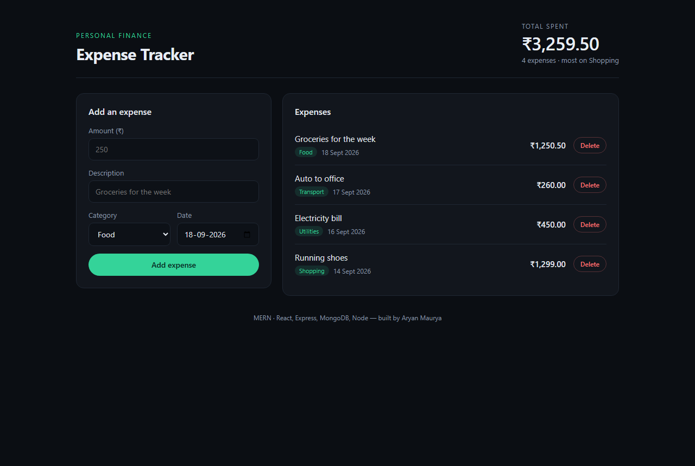

# Personal Expense Tracker — MERN

A full-stack expense tracker with accounts: sign up, add expenses, filter and search
them, edit or delete, and see where the money goes. Each account sees only its own
data. MongoDB, Express, React and Node.

**Live demo:** _add the Vercel URL here_
**API:** _add the Render URL here_



## What it does

- **Accounts** — register and sign in with an email and password; every expense
  belongs to one user and no request can reach another user's data
- Add an expense — amount, description, category and date, validated on both sides
- List every expense, newest first, with the running total
- **Filter by category and search descriptions**, with totals that respect the filter
- **Edit an expense in place**, or delete it
- **A breakdown by category**, so you can see where the money actually goes
- Responsive down to a phone; loading, empty and error states are all handled

## Stack

| Layer | Choice |
| --- | --- |
| Frontend | React 19, TypeScript, Vite |
| Backend | Node.js, Express 5 |
| Database | MongoDB Atlas with Mongoose |
| Styling | Plain CSS, no framework |

## API

Base URL: `http://localhost:4000`

**Accounts**

| Method | Route | Body | Returns |
| --- | --- | --- | --- |
| `POST` | `/api/auth/register` | `{ name, email, password }` | `201` with `{ token, user }` |
| `POST` | `/api/auth/login` | `{ email, password }` | `{ token, user }` |
| `GET` | `/api/auth/me` | — | `{ user }` for the bearer token |

**Expenses** — every route needs `Authorization: Bearer <token>`

| Method | Route | Body | Returns |
| --- | --- | --- | --- |
| `POST` | `/api/expenses` | `{ amount, description, category, date }` | `201` with the created expense |
| `GET` | `/api/expenses` | — | `{ expenses, totalPaise, count, byCategory }`, newest first |
| `PATCH` | `/api/expenses/:id` | any of the create fields | the updated expense |
| `DELETE` | `/api/expenses/:id` | — | `{ id, deleted: true }` |
| `GET` | `/api/health` | — | `{ ok: true, categories }` |

`GET /api/expenses` also accepts `?category=Food`, `?q=metro`, `?from=` and `?to=`.
Totals are computed over the filtered set.

Categories: `Food`, `Transport`, `Housing`, `Utilities`, `Health`, `Shopping`, `Other`.

```bash
curl -X POST http://localhost:4000/api/expenses \
  -H "Content-Type: application/json" \
  -d '{"amount":"1250.50","description":"Groceries","category":"Food","date":"2026-09-18"}'
```

Errors come back as `{ "error": "..." }` with a `400` for bad input, `404` for an
id that does not exist, and `500` only for genuine server faults.

## Three decisions worth explaining

**Money is stored as integer paise, not as a float.** `0.1 + 0.2` is not `0.3` in
floating point, and the headline feature here is a sum. Amounts are parsed to
paise once, at the API boundary, and formatted back to rupees once, in the UI —
so no float arithmetic ever touches a total.

**Passwords are hashed, and the hash is unreachable by accident.** bcrypt at cost 10,
and the field is `select: false` on the schema — a careless `User.find()` cannot leak
it into a response. Login answers "email or password is incorrect" for both failures,
because saying which half was wrong turns a login form into an account-enumeration
tool. Every expense query is scoped by `userId`, so another account's id returns 404
rather than someone else's data.

**The server owns validation.** The client validates too, for a fast response, but
the API assumes nothing: amount must be a positive number, the category must be
one of the known values, the date must parse, and a malformed id returns `400`
rather than throwing a Mongoose `CastError` that would read as a `500`.

## Running it locally

You need Node 20+ and a MongoDB connection string (Atlas free tier is fine).

**1. API**

```bash
cd server
npm install
cp .env.example .env     # then paste your MONGODB_URI
npm run dev              # http://localhost:4000
```

**2. Web**

```bash
cd client
npm install
npm run dev              # http://localhost:5173
```

The client defaults to `http://localhost:4000`. To point it elsewhere, create
`client/.env.local` with `VITE_API_URL=https://your-api.onrender.com`.

## Deploying

Two deployments, because the React build is static and the Express server is not.

**API on Render**
1. New → Web Service → connect this repo, root directory `server`
2. Build `npm install`, start `npm start`
3. Environment: `MONGODB_URI` (your Atlas string), `CORS_ORIGIN` (your Vercel URL)
   and `JWT_SECRET` (any long random string — required in production)
4. In Atlas → Network Access, allow `0.0.0.0/0` so Render can connect

**Web on Vercel**
1. New Project → this repo, root directory `client`
2. Environment: `VITE_API_URL` = your Render URL
3. Deploy, then put that Vercel URL into `CORS_ORIGIN` on Render and redeploy

> Render's free tier sleeps after 15 minutes of inactivity, so the very first
> request can take around 50 seconds while the service wakes. It is not broken.

## Layout

```
server/
  src/
    models/expense.js     schema, validation, JSON shape
    models/user.js        accounts, password hashing
    middleware/auth.js    JWT signing and the requireAuth guard
    routes/auth.js        register, login, me
    routes/expenses.js    the expense endpoints, all scoped to the user
    app.js                express app, CORS, error handling
    index.js              connect to Mongo, then listen
client/
  src/
    lib/api.ts            every call to the API, token storage, money/date formatting
    Root.tsx              decides between the app and the sign-in screen
    Auth.tsx              sign in / create account
    App.tsx               the dashboard
    App.css
```

---

Built by [Aryan Maurya](https://github.com/Aryanmaurya283).
